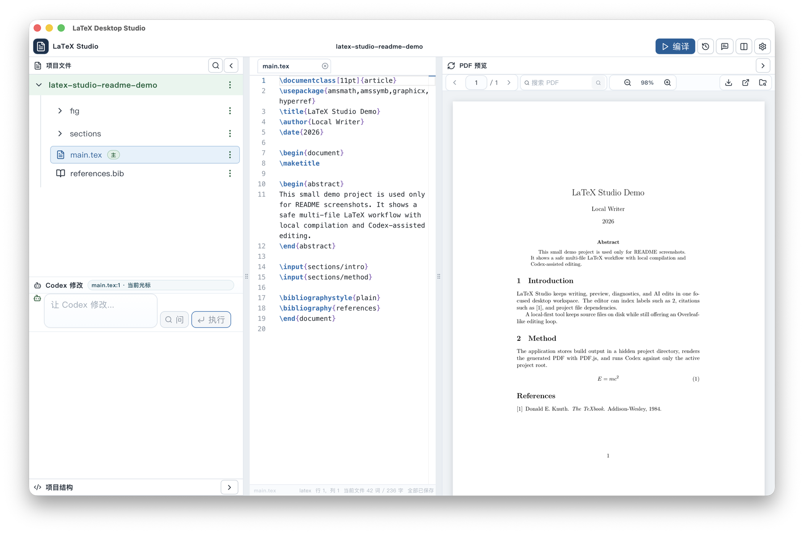
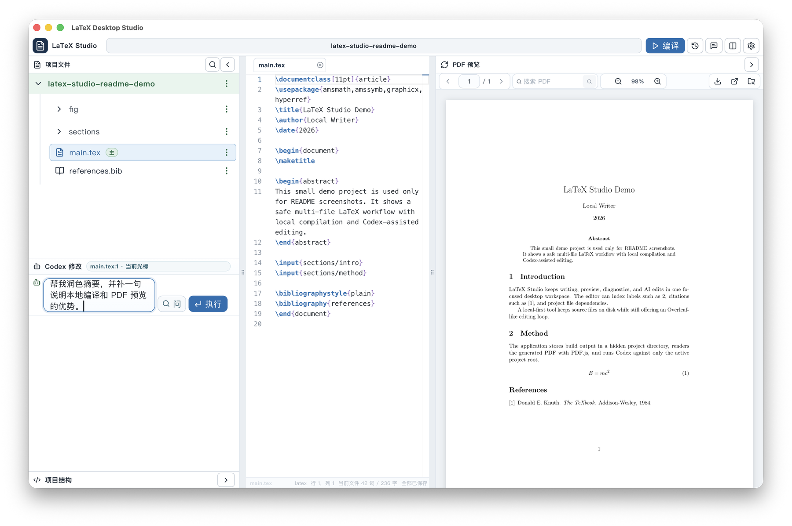

# LaTeX Desktop Studio

[中文说明](#中文说明) | [English](#english)

LaTeX Desktop Studio is a local-first desktop LaTeX editor inspired by Overleaf. It combines a focused paper-writing workspace, local LaTeX compilation, PDF preview, review comments, save history, and Codex-powered natural-language project editing.

LaTeX Desktop Studio 是一个受 Overleaf 启发的本地优先 LaTeX 桌面编辑器。它把论文写作区、本地编译、PDF 预览、批注、保存历史和 Codex 自然语言修改整合到一个专注的桌面工作流里。

## Screenshots / 使用截图

### Workspace With PDF Preview / 编辑与 PDF 预览



### Codex Command Area / Codex 自然语言修改区



---

## 中文说明

### 项目定位

LaTeX Desktop Studio 的目标是做一个“本地单人版 Overleaf”：打开后第一屏就是论文工作区，而不是一个通用 IDE。它适合本地写论文、课程报告、preprint、slides 或多文件 LaTeX 项目的人，尤其适合希望用自然语言让 Codex 直接修改当前 LaTeX 项目的人。

它不是为了复制 VS Code 的所有能力，而是专注于最常见的论文写作循环：

1. 打开或新建 LaTeX 项目。
2. 编辑 `main.tex`、章节文件、参考文献、图片和样式文件。
3. 本地编译并在右侧预览 PDF。
4. 编译失败时直接在预览区查看诊断并跳转源码。
5. 用 Review 批注记录需要修改的内容。
6. 用 Codex 根据当前项目上下文修正文稿、补内容、修错误或整理引用。
7. 查看 diff，确认或回退修改。
8. 导出 PDF 或整个项目 ZIP。

### 为什么不是 VS Code + LaTeX Workshop + Codex

VS Code 很强，但它是通用 IDE。这个项目选择自己做桌面 App，是因为论文写作需要一个更窄、更安静的工作流：

- 第一屏就是论文、文件树和 PDF，不需要从 IDE 面板里拼装环境。
- 编译错误直接出现在 PDF 预览区域，用户不用在日志面板里找红字。
- Codex 不只是看到当前文件，而是能拿到项目结构、章节顺序、label/citation、`.bib`、本地 `.sty/.cls`、宏定义、依赖关系、未解决引用、编译诊断和 Review 批注。
- Codex 默认只能在当前 LaTeX 项目根目录内工作，和 App 源码隔离。
- 修改结果以 diff、编辑器增删高亮和历史记录呈现，方便确认和回退。
- 本地优先，不需要上传论文项目到云端。

### 主要功能

#### 项目工作区

- 新建、打开、重命名、导入和导出 LaTeX 项目。
- 支持 `main.tex`、章节文件、`.bib`、图片、`.sty`、`.cls` 和其它项目资源。
- 每个项目使用 `.latex-studio.json` 保存主文件、编译目录、引擎和安全参数。
- 文件树支持创建、重命名、删除、导入文件、设置主文件。
- 支持项目内搜索、替换和回滚快照。
- 内置 article、preprint、多文件论文、中文论文、Beamer、空白文档等模板。

#### 编辑器

- 基于 Monaco Editor 的 LaTeX 编辑体验。
- 白底写作主题，支持命令、注释、字符串、括号和操作符高亮。
- 多标签页、未保存状态、关闭确认和会话恢复。
- 当前文件查找/替换。
- 可配置快捷键。
- LaTeX 常用片段插入。
- 自动换行和字体大小持久化。
- 支持文件引用、label、citation 和 BibTeX 元数据补全/悬停提示。

#### 编译与预览

- 默认使用 `latexmk + xelatex`。
- 编译参数包含 `-interaction=nonstopmode`、`-file-line-error`、`-synctex=1`、`-halt-on-error`。
- 编译输出放在项目隐藏目录中，避免污染源码目录。
- 编译成功后自动刷新 PDF。
- 编译失败时在右侧预览区域显示诊断，而不是弹出冗长日志。
- 诊断可以跳转到源码行。
- 支持从头编译，清理旧的构建缓存。
- PDF 预览支持翻页、搜索、缩放、导出、系统阅读器打开、Finder 定位和 SyncTeX 源码/PDF 定位。

#### Codex 修改

- 使用本地 Codex CLI：优先使用 `PATH` 里的 `codex`，也会检查 `/Applications/Codex.app/Contents/Resources/codex`。
- App 本身不需要单独配置 OpenAI API Key。
- Codex 以当前 LaTeX 项目为工作目录运行。
- 支持自然语言修改项目，也支持“只问不改”。
- 支持 `@file` 引用项目文件，支持 `#label` / `#citation` 引用符号。
- 可把当前选区、当前章节、Review 批注、编译错误、引用问题、依赖文件等加入上下文。
- “仅上下文”模式会把允许修改的文件列表传给后端；如果 Codex 越界改了其它项目文件，后端会在自动编译前从快照恢复这些文件。
- 从编译诊断、单条 Review/TODO 批注、缺失引用触发的快捷修复会自动限制到相关项目文件，减少 AI 修改无关内容的风险。
- 运行过程以对话式记录展示。
- 修改前创建快照，修改后显示统一 diff。
- 编辑器中对 Codex 增删行做绿色/红色高亮。
- 支持确认修改、回退整次 Codex 修改或只回退某个文件。
- 可在 Codex 修改后自动重新编译。

#### Review 与历史

- Review 批注模式，可通过快捷键进入。
- `% TODO:`、`% FIXME:`、`% NOTE:`、`% REVIEW:` 会在侧栏索引。
- `% REVIEW:` 到 `% REVIEW-END` 的块可以在编辑器中高亮。
- 批注可以交给 Codex 单条修复或批量处理。
- 自动保存或手动保存产生真实内容变化时，会记录保存历史。
- 重命名、删除、替换、恢复等结构性操作会创建回滚快照。
- 历史版本支持 diff 预览和恢复。

#### 安全边界

- 后端文件操作会把路径规范化到项目根目录内。
- 拒绝 `../` 路径逃逸和符号链接逃逸。
- 构建文件、缓存和内部元数据放在 `.latex-studio/`。
- 文件列表隐藏内部构建产物。
- Codex 默认只修改当前 LaTeX 项目，而不是这个 App 的源码仓库。
- Codex 运行和保存历史都支持回退。
- 项目 ZIP 导出会排除构建输出和内部元数据。

### 环境要求

#### 开发运行

- macOS
- Node.js
- pnpm
- Rust 和 Cargo
- Tauri CLI，通过项目依赖安装

#### LaTeX 编译

需要安装包含以下命令的 TeX 发行版：

- `latexmk`
- `xelatex`
- 可选：`pdflatex`、`lualatex`

macOS 上常用 MacTeX 或 BasicTeX。如果没有检测到 TeX 工具，App 仍可用于编辑和 Codex 修改，但编译和 PDF 预览会显示安装提示。

#### Codex 修改

需要本机安装并登录 Codex。App 会检查：

- `PATH` 中的 `codex`
- `/Applications/Codex.app/Contents/Resources/codex`

App 不会要求输入 OpenAI API Key。

### 从源码运行

```bash
pnpm install
pnpm tauri dev
```

仅调试前端界面：

```bash
pnpm dev
```

Vite 开发服务默认地址：

```text
http://127.0.0.1:1420/
```

完整桌面 App 需要通过 Tauri 运行。

### 构建桌面 App

```bash
pnpm tauri build
```

macOS app bundle 会生成在：

```text
src-tauri/target/release/bundle/macos/LaTeX Desktop Studio.app
```

### 测试

```bash
pnpm exec tsc --noEmit
node scripts/verify-ui-regressions.mjs
node scripts/test-editor-logic.mjs
cd src-tauri && cargo test
```

Rust 测试包含 fake `latexmk` 和 fake `codex` 集成流程，因此 CI 不需要完整 TeX Live 也能验证核心编译和 Codex 修改管线。

### 仓库结构

```text
.
├── docs/screenshots/       # README 使用截图
├── src/                    # React / TypeScript / Monaco / PDF.js 前端
├── src/components/         # UI 组件
├── src/lib/                # 前端共享逻辑
├── src-tauri/              # Rust 后端和 Tauri 配置
├── scripts/                # 本地回归检查脚本
├── package.json            # 前端脚本和依赖
├── pnpm-lock.yaml          # pnpm lockfile
└── README.md
```

### 隐私说明

这个仓库只应该包含 App 源码，不应该包含：

- 用户自己的 LaTeX 项目
- `.latex-studio/` 项目内部元数据
- 编译生成的 PDF 或构建目录
- Codex 本地会话状态
- API Key、token、私钥或 `.env` 文件
- `node_modules`、pnpm store、Vite build 输出或 Rust target 输出

发布前应执行 secret scan 和大文件检查。本仓库的 `.gitignore` 已排除常见本地文件、构建文件和项目私有数据。

### 当前限制

- v1 是本地单人版，没有云同步、账号、实时协作、评论协作或多人历史版本。
- 真实编译依赖本机 TeX 环境。
- Codex 修改依赖本机 Codex CLI 和登录状态。
- 目前主要面向 macOS 桌面打包。

### 后续方向

- 更完整的 Overleaf 风格历史版本。
- 更强的 SyncTeX 双向定位。
- 大项目性能 profiling。
- 本地模板库或模板市场。
- 更细到行块/hunk 级别的 Codex 修改范围控制。
- 编辑器 gutter 中更丰富的可视化 diff。
- 自动化 release 打包。

---

## English

### What It Is

LaTeX Desktop Studio is a local-first desktop LaTeX editor for single-user paper writing. It aims to feel like a local Overleaf workspace: a project tree on the left, a Monaco-based LaTeX editor in the center, PDF.js preview on the right, compile diagnostics inside the preview area, and a Codex panel that can modify only the active LaTeX project.

The app is built with Tauri, React, Vite, TypeScript, Monaco Editor, PDF.js, and Rust. LaTeX compilation and Codex runs happen locally.

### Why Not Just VS Code + LaTeX Workshop + Codex?

VS Code is powerful, but it is a general-purpose IDE. This app optimizes for a narrower writing loop:

- The first screen is the paper workspace, not an IDE layout.
- Compile errors appear directly in the PDF preview space.
- Codex receives LaTeX-aware project context instead of only the currently opened file.
- Codex is constrained to the active project root by default.
- Codex changes are shown as diffs and highlighted inside the editor.
- Review comments, unresolved references, compile diagnostics, document order, and dependencies can be passed to Codex as context.
- Projects remain local on disk.

The goal is not to replace every IDE feature. It is to make the common LaTeX writing, previewing, fixing, and revising loop faster and calmer.

### Features

#### Project Workspace

- Create, open, rename, import, and export LaTeX projects.
- Multi-file project model with `main.tex`, sections, bibliographies, figures, `.sty`, `.cls`, and assets.
- Per-project `.latex-studio.json` settings for the main file, build directory, engine, and safe extra `latexmk` arguments.
- File tree actions for create, rename, delete, import, and set-as-main.
- Project-wide search and replace with rollback snapshots.
- Templates for article drafts, preprints, multi-file papers, Chinese documents, Beamer slides, and blank projects.

#### Editor

- Monaco-based LaTeX editor with a white writing theme.
- Syntax highlighting for commands, comments, strings, delimiters, and operators.
- Tabs with dirty-state tracking, close confirmation, and session restore.
- Current-file find and replace.
- Configurable shortcuts.
- Snippet insertion for common LaTeX structures.
- Word wrap and persisted editor font size.
- Hover and completion support for project file references, labels, citations, and BibTeX metadata.

#### Compile And Preview

- Default compile pipeline: `latexmk + xelatex`.
- Compile flags include `-interaction=nonstopmode`, `-file-line-error`, `-synctex=1`, and `-halt-on-error`.
- Hidden build output under project metadata.
- Successful compile refreshes the PDF preview.
- Failed compile shows a diagnostic view in the PDF preview area.
- Clickable diagnostics jump to source lines.
- Clean compile clears stale build artifacts before retrying.
- PDF preview supports page navigation, search, zoom, export, open in system viewer, reveal in Finder, and SyncTeX navigation.

#### Codex Editing

- Uses the local Codex CLI from `PATH` or `/Applications/Codex.app/Contents/Resources/codex`.
- No separate OpenAI API key is required by this app.
- Runs Codex with the active LaTeX project as the working directory.
- Supports edit mode and ask-only mode.
- Supports `@file` mentions and `#label` / `#citation` symbol mentions.
- Can include selected source, current section, review comments, compile diagnostics, reference issues, dependency files, and document structure as context.
- Context-only mode sends the allowed edit file list to the backend; if Codex edits files outside that scope, the backend restores them from the pre-run snapshot before auto-compile.
- Quick fixes launched from compile diagnostics, individual review/TODO comments, or unresolved references automatically narrow Codex edits to the relevant project files.
- Streams progress into a chat-like transcript.
- Creates pre-run snapshots and unified diffs.
- Highlights additions and removals inside the editor.
- Supports accepting changes, reverting an entire Codex run, or reverting one changed file.
- Can auto-recompile after Codex edits.

#### Review And History

- Review mode with configurable shortcuts.
- `% TODO:`, `% FIXME:`, `% NOTE:`, and `% REVIEW:` comments are indexed in the sidebar.
- `% REVIEW:` blocks can highlight reviewed source ranges until `% REVIEW-END`.
- Review comments can be resolved, restored, or handed to Codex.
- Save history is recorded when manual save or auto-save produces real content changes.
- Structural operations such as rename, delete, replace, and restore create rollback snapshots.
- History diff preview and restore are available from the top bar.

#### Safety Model

- Backend file operations normalize paths under the project root.
- `../` escapes and symlink escapes are rejected.
- Project build/cache files are hidden under `.latex-studio/`.
- Internal metadata and build artifacts are hidden from the file tree.
- Codex is run against the active LaTeX project, not this app's source tree.
- Codex snapshots and project history support rollback.
- Project ZIP export excludes build output and internal metadata.

### Requirements

#### Development

- macOS
- Node.js
- pnpm
- Rust and Cargo
- Tauri CLI, installed through the project dev dependency

#### LaTeX Compilation

Install a TeX distribution that provides:

- `latexmk`
- `xelatex`
- optionally `pdflatex` and `lualatex`

On macOS, MacTeX or BasicTeX are typical choices. If no TeX tools are found, the app remains usable for editing and Codex, while compile and PDF preview show setup guidance.

#### Codex Editing

Install and sign in to Codex locally. The app checks:

- `codex` on `PATH`
- `/Applications/Codex.app/Contents/Resources/codex`

The app does not ask for an OpenAI API key.

### Run From Source

```bash
pnpm install
pnpm tauri dev
```

For UI-only development:

```bash
pnpm dev
```

The Vite dev server uses:

```text
http://127.0.0.1:1420/
```

The full desktop application runs through Tauri.

### Build

```bash
pnpm tauri build
```

The macOS app bundle is generated under:

```text
src-tauri/target/release/bundle/macos/LaTeX Desktop Studio.app
```

### Test

```bash
pnpm exec tsc --noEmit
node scripts/verify-ui-regressions.mjs
node scripts/test-editor-logic.mjs
cd src-tauri && cargo test
```

The Rust test suite includes fake `latexmk` and fake `codex` integration flows, so the main compile/edit pipeline can be tested without requiring a full TeX Live installation in CI.

### Typical Workflow

1. Create or open a LaTeX project.
2. Edit `main.tex`, section files, bibliography files, or local style files.
3. Compile with the top-right compile button or the configured shortcut.
4. If compilation fails, inspect diagnostics in the preview area and optionally ask Codex to explain or fix the error.
5. Use the PDF preview for reading, searching, and source/PDF navigation.
6. Add review comments while reading or editing.
7. Use Codex to revise selected text, fix comments, repair citations, or edit specific project dependencies.
8. Review the Codex diff, accept it, or revert all or part of it.
9. Use save history to inspect or restore earlier saved versions.
10. Export the PDF or the project source ZIP when ready.

### Repository Layout

```text
.
├── docs/screenshots/       # README screenshots
├── src/                    # React, TypeScript, Monaco, PDF.js UI
├── src/components/         # UI components
├── src/lib/                # Shared frontend logic
├── src-tauri/              # Rust backend and Tauri configuration
├── scripts/                # Local regression and editor-logic checks
├── package.json            # Frontend scripts and dependencies
├── pnpm-lock.yaml          # pnpm lockfile
└── README.md
```

### Privacy Notes

This repository is intended to contain application source code only. It should not contain:

- user LaTeX projects
- `.latex-studio/` project metadata
- compiled PDFs or build directories
- local Codex conversation state
- API keys, tokens, private keys, or `.env` files
- `node_modules`, pnpm store, Vite build output, or Rust target output

Before publishing, run a secret scan and file-size scan. The included `.gitignore` excludes common local, build, and private project artifacts.

### Limitations

- v1 is local-only and single-user.
- There is no cloud sync, account system, realtime collaboration, collaborative comments, or multi-user history.
- Real compilation requires local TeX tooling.
- Codex behavior depends on the installed local Codex CLI and login state.
- The UI currently focuses on macOS desktop packaging.

### Roadmap Ideas

- More complete Overleaf-style project history.
- Richer PDF/source SyncTeX interactions.
- Better large-project performance profiling.
- Optional local template library or template marketplace.
- Hunk-level Codex edit-scope controls.
- Visual diff overlays directly in the editor gutter.
- Optional automated release packaging.
